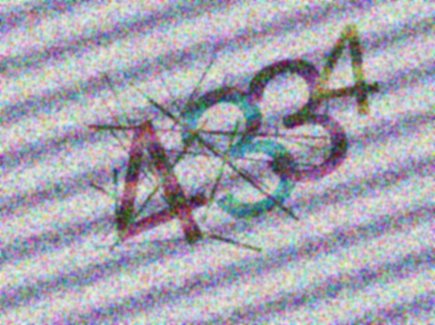
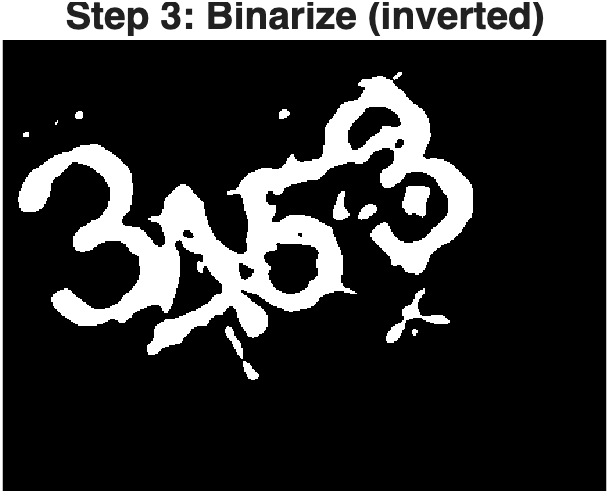
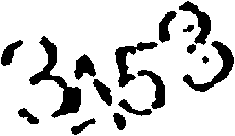

# CAPTCHA Digit Classification
A MATLAB-based image analysis pipeline and multi-class SVM classifier designed to denoise, segment, and identify digits in heavily distorted CAPTCHA images.

## Overview
This repository contains a MATLAB-based image analysis script designed to classify digits within highly distorted CAPTCHA images. This project was developed by Team 22 for the "Introduction to Image Analysis" (1MD110) course at Uppsala University, Autumn 2025 

## The Challenge
The objective of this project was to correctly identify all digits in provided CAPTCHA images without the use of deep neural networks or readily available OCR functions. 
* The CAPTCHA images contain either 3 or 4 digits
* The only possible digits present are 3, 4, and 5
* The images are obscured by structured noise (diagonal lines), random noise, and random intersecting lines
* The digits themselves appear in various scales and slight rotations

## Visual Pipeline

**Input CAPTCHA Example:**

**Binary Step:**

**Final Segmented Output:**

## Methodology
To process the images and classify the digits, we built a custom pipeline from scratch:

* **Denoising:** We applied filtering in the frequency domain using a notch filter to remove structured noise and a Butterworth low-pass filter to reduce random noise To remove intersecting lines, we utilized morphological operations, specifically eroding and dilating the image with disk-shaped structuring elements
* **Segmentation & Digit Separation:** The denoised images were converted to binary using Otsu's thresholding Because digits sometimes overlapped, we dynamically split the bounding box of the true pixels into 3 or 4 equal-sized rectangles based on a total width threshold (264 pixels) to isolate individual digits
* **Feature Extraction:** A comprehensive set of features was extracted from each segmented digit to feed into the classifier These included region-based shape features (Area, Circularity, etc.), Hu moments, Euler number, convexity ratio, stroke strength, radial and orientation-rotated zoning features, LBP, and HOG features
* **Classification:** We trained a multi-class Support Vector Machine (SVM) utilizing Error-Correcting Output Codes (ECOC) and a Radial Basis Function (RBF) kernel, which handled the non-linear decision boundaries well 

## Results
We evaluated our model by predicting the accuracy of identifying a single digit as well as the accuracy of perfectly identifying all digits in a given CAPTCHA 

| Metric | Training Set | Validation Set |
| :--- | :--- | :--- |
| **Accuracy (Single Digit)** | 99.27% | 89.30% |
| **Accuracy (All Digits)** | 92.81% | 68.46% |

**Final Performance:** On the final held-out test set, the classifier achieved an overall accuracy of **69%** for correctly predicting all digits in the CAPTCHAs

## Authors
* Elias Swanberg
* Md Fahim